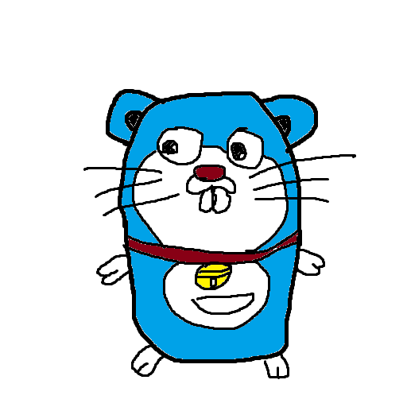

# GopherEmon

ゴファえもん



## CLI Installation

```console
go get github.com/zztkm/gopher-emon/cmd/gopheremon
```

## License

This code is provided under the [MIT license](./LICENSE).
The image files of gopher which is created by Renee French are provided under the [Creative Commons 3.0 Attribution license](https://creativecommons.org/licenses/by/3.0/).
